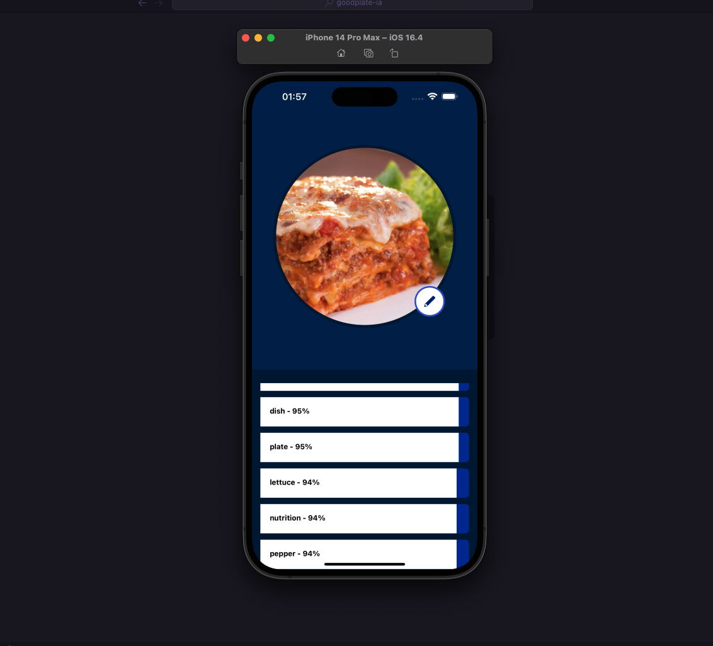

    

 

# GoodPlate IA

> GoodPlate IA | Pratos descritos por uma Inteligência Artificial

## 💻 Projeto

Através desse projeto, desenvolvi um app mobile que podemos enviar uma imagem e ele nos retorna o quão saudável esse prato está. Reconhecendo cada item e melhorando nosso prato de comida através de uma inteligência artificial chamada ClarifAI

## 🔖 Layout

Você pode visualizar o layout do projeto através [desse link](). É necessário ter conta no [Figma](https://figma.com) para acessá-lo.

---

### 📄 O que foi usado:

- React Native
- Expo
- Axios
- Expo Image Manipulator
- Expo Image Pick
- Typescript
- Expo Font
- Expo Icons
- Expo Google Fonts

### 🛠 Mão na massa:

> Você pode realizar o clone deste repositório!

Clone o repositório:

`git clone https://github.com/Lucaslimasz/IA-food-photo`

### 💻 Executando o projeto 🚀

#### Na raiz do projeto, execute os comandos:

# Para instalar as dependências

yarn

# Para startar o projeto utilize

Iniciar o projeto com `yarn start`
